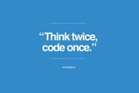
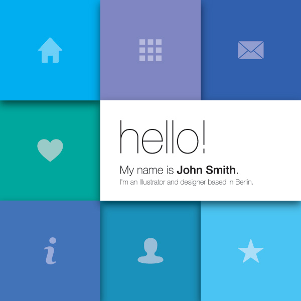

## Design of Complex Websites
##### Newsletter - September 17, 2015
---
#### 1. [How the Internet Works for Developers](https://www.youtube.com/watch?v=e4S8zfLdLgQ)

#### 2. [Thinking Responsively: A Framework for Future Learning](http://alistapart.com/article/thinking-responsively-a-framework-for-future-learning)

#### 3. [Standards for developing flexible, durable, and sustainable HTML and CSS](http://codeguide.co/)

#### 4. [Example Portfolio](http://shanedudfield.com/)

#### 5. Useful Tools
* Website Prototyping - [Marvel](https://marvelapp.com/)
* Mobile Prototyping - [Pixate](https://pixate.com/)
* Interface Design - [Sketch](http://bohemiancoding.com/sketch/)

---
######*Copyright © 2015 University of Michigan, School of Information*
