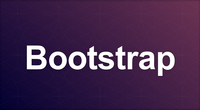

## Design of Complex Websites
##### Newsletter - September 27, 2015
---
#### 1. [Introduction to Bootstrap](https://www.youtube.com/watch?v=wesUO81YX0U)

#### 2. [Learn to use built-in Browser Support for Responsive Images](http://www.html5rocks.com/en/tutorials/responsive/picture-element/)

#### 3. [Introduction: Getting your project on Github](https://guides.github.com/introduction/getting-your-project-on-github/)

#### 4. Portfolio Related
* [The Foundation of a great UX Portfolio](http://writing.enchant.co/2015/02/09/the-foundation-of-a-great-ux-portfolio/)
* [Example of a Visual Designer Portfolio](http://jimmyedlund.se/)
* [Example of a UX Portfolio](http://www.williammacivor.com/)

#### 5. Useful Tools
* Screen Sizes of various devices - [Screensiz](http://screensiz.es/phone)
* Icon set for the modern web - [Iconic](https://useiconic.com/)

---
######*Copyright © 2015 University of Michigan, School of Information*
